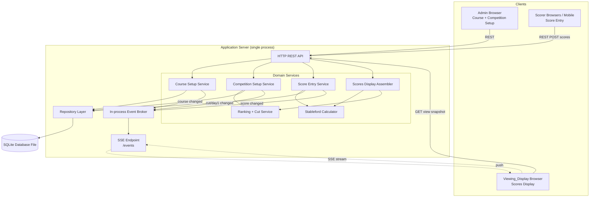
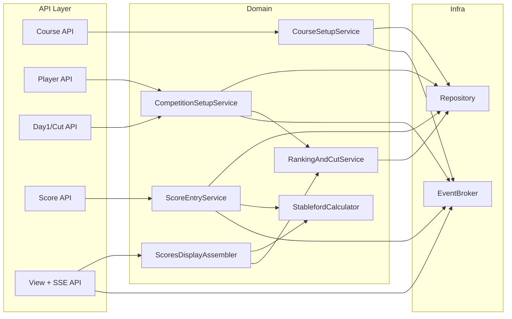
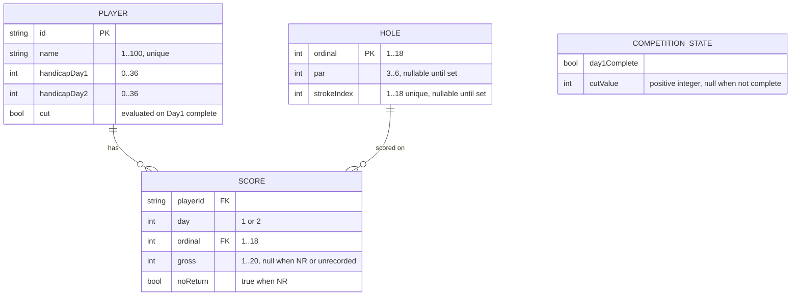

# Design Document

## Overview

The Club Championship Scoring tool is a small, single-club web application that runs a two-day, 18-holes-per-day golf championship. It supports four functional areas — Course Setup, Competition Setup (including Day 1 completion and cut), Score Entry, and Scores Display — and pushes score changes to a clubhouse Viewing_Display in real time.

The design goal is to be **pragmatic and deployable for a single golf club**: a single small server process, a single embedded database file, a handful of concurrent scorers on mobile browsers, and one (or a few) clubhouse display browsers. It does not need horizontal scaling, multi-tenancy, or a distributed message broker. It does need correct scoring math, correct ranking and cut logic, robust multi-scorer concurrent writes, and reliable near-real-time updates with graceful reconnection.

Key design decisions:

- **Server-authoritative scoring.** All Stableford, handicap-allocation, ranking, and cut calculations happen on the server. Scorers submit raw gross strokes or NR; the Viewing_Display renders derived values the server computes. This keeps the browser clients thin and guarantees every viewer sees identical, consistent results (Requirements 4, 5, 6, 8, 9).
- **Server-Sent Events (SSE) for the real-time layer.** The data flow is overwhelmingly one-directional: many scorers write occasionally over ordinary HTTP, and the display consumes a continuous stream of updates. SSE fits this shape, is simpler than WebSockets, runs over plain HTTP/HTTPS, and has built-in automatic reconnection with a `Last-Event-ID` cursor that directly supports the "resync on reconnect" requirement (Requirements 10.4, 10.5). For a one-way dashboard this is the lower-complexity choice ([SSE vs WebSockets guidance](https://vercel.com/i/websocket-vs-server-sent-events); content rephrased for compliance with licensing restrictions).
- **Single embedded relational database (SQLite).** A single club's championship is a small, bounded dataset (≤ a few hundred players, 18 holes, ≤ 36 score cells per player). SQLite needs no separate server, persists to one file, is trivially backed up, and its transactional guarantees make concurrent multi-scorer writes safe (Requirement 7.10).
- **Recompute-on-read for derived values.** Because the dataset is tiny, the server recomputes aggregates, rankings, and Stableford points from raw scores whenever a change occurs, rather than maintaining denormalized caches that could drift. This eliminates a whole class of consistency bugs and comfortably meets the 5-second update budget.

## Architecture

### High-level architecture



### Request and update flow

1. **Setup (Admin).** The admin configures holes and players over normal REST calls. Values are validated server-side and persisted to SQLite.
2. **Score entry (Scorer).** A scorer POSTs a gross-strokes value or `NR` for a `(player, day, hole)` triple. The Score Entry Service validates it, persists it in a transaction, and emits a `score-changed` event to the in-process broker.
3. **Fan-out (Broker → SSE).** The broker forwards the event to every connected SSE client. Each event carries a monotonically increasing sequence id used as the SSE event id.
4. **Display refresh.** On receiving an event, the Viewing_Display re-fetches (or receives) the recomputed view snapshot for its currently selected day and re-renders the affected rows. All derived numbers (Stableford points, aggregates, positions, cut) are computed server-side.
5. **Reconnect.** If the display's SSE connection drops, the browser's `EventSource` auto-reconnects and sends the last-seen sequence id via `Last-Event-ID`. The server replays events since that id (or instructs a full snapshot reload), so no updates are lost (Requirement 10.5).

### Deployment topology

A single server process (application + SSE + static frontend assets) plus one SQLite file. Recommended to run behind a reverse proxy (e.g. Caddy or nginx) terminating HTTPS on the club LAN. No external services are required. Backups are a file copy of the SQLite database.

### Technology choices and rationale

| Layer | Choice | Rationale |
|-------|--------|-----------|
| Language / runtime | **Node.js + TypeScript** | Single language across server and browser reduces cognitive load for a small team; TypeScript gives compile-time safety for the scoring domain types (Day, Hole, points). Any comparable stack (Python + FastAPI, Go) would also satisfy the design; the abstractions below are language-agnostic. |
| Backend framework | **Fastify (or Express)** | Lightweight HTTP framework with first-class SSE support and low overhead — appropriate for a small single-node app. |
| Real-time transport | **Server-Sent Events (SSE)** | One-way server→client push, works over HTTP/HTTPS, auto-reconnect with `Last-Event-ID`, no extra broker. Matches the display-update requirement without WebSocket complexity (Requirement 10). |
| Persistence | **SQLite** (via `better-sqlite3` or Prisma) | Zero-ops embedded DB, single-file backup, ACID transactions for safe concurrent writes. Sized correctly for one club. |
| Frontend | **React + TypeScript + Vite** | Component model maps cleanly to the score tables and setup forms; `EventSource` integrates trivially. Mobile-first responsive layout for scorers (Requirement 7.9). A server-rendered template stack would also work. |
| Styling | Responsive CSS (e.g. Tailwind or plain CSS grid) | The score tables must be readable on a clubhouse monitor and usable on phones. |

Rationale for SSE over WebSockets specifically: score entry is an ordinary HTTP POST and needs no persistent client→server channel, while the display only consumes. SSE is the simpler, lower-operational-cost fit for one-directional live dashboards, and its native reconnection semantics map directly to the connection-status and resync requirements ([WebSockets vs SSE practical guidance](https://vercel.com/i/websocket-vs-server-sent-events); content rephrased for compliance with licensing restrictions). WebSockets would be chosen if the display needed to send data at the same rate it receives, which it does not here.

## Components and Interfaces

### Component map



### CourseSetupService (Requirement 1)

Responsible for hole configuration and completeness.

- `getHoles(): Hole[]` — returns all 18 holes with current par/stroke index (nulls where unset).
- `setPar(ordinal, par): Result` — validates `par ∈ [3,6]` integer; on failure retains stored value and returns the permitted range (1.2, 1.5, 1.6, 1.7).
- `setStrokeIndex(ordinal, strokeIndex): Result` — validates `strokeIndex ∈ [1,18]` integer and **uniqueness**; on duplicate, returns the conflicting `Hole_Ordinal` and retains stored value (1.3, 1.4, 1.5, 1.6, 1.7).
- `isCourseComplete(): boolean` — true iff all 18 pars valid AND the 18 stroke indices are exactly the set {1..18} with no duplicates/omissions (1.8).
- Callers requiring course config (Stableford Calculator inputs) receive an "incomplete configuration" indication when `isCourseComplete()` is false (1.9).

### CompetitionSetupService (Requirements 2, 3)

Manages players, per-day handicaps, and Day 1 completion / cut.

- `addPlayer(name): Result` — validates name length `1..100` and uniqueness (2.1, 2.2, 2.3).
- `setHandicap(playerId, day, handicap): Result` — validates whole number `0..36`; stores Day 1 and Day 2 independently (2.5, 2.6, 2.7, 2.8).
- `updatePlayer(...)`, with persistence-failure handling that retains last stored values and reports the save did not complete (2.9, 2.10).
- `markDay1Complete(cutValue): Result` — requires `cutValue` to be a positive integer; if invalid, does not set Day_1_Complete and returns the "must be a positive integer" message (3.1, 3.2, 3.3). On success, sets Day_1_Complete, persists Cut_Value, invokes RankingAndCutService to evaluate and persist CUT status for every player, then emits a `day1-status-changed` event (3.4–3.9).
- `reverseDay1Complete(): Result` — clears Day_1_Complete, Cut_Value, and every player's CUT status, persists cleared state, emits event (3.10).

### ScoreEntryService (Requirement 7)

Handles scorer submissions.

- `submitScore(playerId, day, ordinal, value): Result` where `value` is an integer `1..20` **or** the token `NR`.
  - Numeric out-of-range / empty / non-integer → reject, retain prior value, return permitted range 1..20 (7.3, 7.4).
  - Valid numeric → upsert (replace existing) against `(player, day, ordinal)` (7.5, 7.6).
  - `NR` → upsert a No_Return status for the cell, replacing any existing value (7.11, 7.12).
  - CUT player + Day 2 submission → reject, do not persist, return "player is cut" (7.14).
  - Confirms success to the scorer within 3s; on persistence timeout returns a save-failed error and preserves the entered value for resubmission (7.7, 7.8).
- Persistence uses a per-cell transaction so concurrent submissions for different players (or different cells) both succeed (7.10, 7.13).
- Presents player list and day/hole selection to scorers; works on web and mobile browsers (7.1, 7.2, 7.9).

### StablefordCalculator (Requirements 4, 5)

Pure functions. No I/O; deterministic given inputs.

- `allocateHandicapStrokes(playingHandicap, strokeIndexByHole): Map<ordinal, strokes>` — one stroke where `strokeIndex ≤ handicap`, plus a second where `strokeIndex ≤ handicap − 18`; zero for handicap 0; returns "inputs unavailable" if handicap or any stroke index missing (4.1–4.4).
- `netStrokes(gross, handicapStrokesOnHole): int` = `gross − handicapStrokesOnHole` (5.1).
- `stablefordPoints(net, par): 0..5` mapping net-vs-par (5.2–5.7). See algorithm below.
- Invalid gross (non-numeric / non-integer / `< 1`) → error indication, no computation (5.8).
- No recorded value → 0 points; `NR` hole → 0 points; other numeric holes on an NR day still computed (5.9, 5.10, 5.11).

### RankingAndCutService (Requirements 3, 6)

- `rankScratch(day1Scores): Map<playerId, position|null>` — ascending Day 1 aggregate gross, standard competition ranking with ties, NR players excluded (null) (6.1, 6.3).
- `rankStableford(day1Scores): Map<playerId, position|null>` — descending Day 1 aggregate Stableford, standard competition ranking with ties, NR players excluded (null) (6.2, 6.3).
- `evaluateCut(cutValue, scratchPositions, stablefordPositions, nrByPlayer): Map<playerId, CUT|advance>` — implements the cut rule (3.5, 3.6, 3.7).
- Recomputation triggered on every Day 1 score/NR persistence, within the 5-second budget (6.4).

### ScoresDisplayAssembler (Requirements 8, 9, 10)

Builds a complete, render-ready snapshot for a given day, so the client is purely presentational.

- `buildDay1View(): Day1View` — header (ordinal/par/SI 1..18), one row per player with per-hole `"strokes (points)"` cells (empty where unrecorded, `"NR"` where NR), aggregate strokes with scratch position `"total (position)"`, aggregate Stableford with Stableford position `"total (position)"`, and signed relative-to-par; NR and no-completed-holes handling per 8.1–8.15.
- `buildDay2View(): Day2View` — header, ordering (non-CUT by relative-to-par asc then name; CUT last, alphabetical), Day 1 aggregate column, per-hole Day 2 cells, combined strokes `"day1total (day2total)"`, combined Stableford `"total36 (day2total)"`, cumulative relative-to-par, and CUT/NR handling per 9.1–9.18.

### View + SSE API (Requirement 10)

- `GET /api/view/day1`, `GET /api/view/day2` — return the assembled snapshot (used on initial load and after reconnect).
- `GET /api/events` (SSE) — streams `score-changed`, `day1-status-changed`, `course-changed`, `player-changed` events, each with an incrementing `id`. Emits periodic heartbeat comments to detect dead connections. Honors `Last-Event-ID` for replay/resync.
- The client's `EventSource` reconnects automatically; on `onerror` the UI shows the connection-status indicator (10.4), and on reconnect it clears the indicator and reloads the current view snapshot (10.5). Selected day view is client-side state retained across updates (10.6).

### REST interface summary

| Method | Path | Purpose | Requirements |
|--------|------|---------|--------------|
| GET/PUT | `/api/course/holes` | Read / update par & stroke index | 1 |
| GET | `/api/course/status` | Completeness indicator | 1.8, 1.9 |
| GET/POST/PUT | `/api/players` | Manage players & handicaps | 2 |
| POST | `/api/day1/complete` | Mark Day 1 complete with cut value | 3.1–3.9 |
| DELETE | `/api/day1/complete` | Reverse Day 1 complete | 3.10 |
| POST | `/api/scores` | Submit gross strokes or NR | 7 |
| GET | `/api/view/{day}` | Assembled display snapshot | 8, 9 |
| GET | `/api/events` | SSE update stream | 10 |

## Data Models



### Model notes

- **Hole**: exactly 18 rows keyed by `ordinal`. `par` and `strokeIndex` are nullable until configured; the completeness check (Requirement 1.8) requires all pars valid and stroke indices forming {1..18}.
- **Score cell**: the unique key is `(playerId, day, ordinal)`. A cell is in one of three states: *unrecorded* (no row / both null), *numeric* (`gross ∈ [1,20]`, `noReturn = false`), or *NR* (`noReturn = true`, `gross = null`). NR is recorded **per hole**; a player's "NR status on a Day" means at least one Day cell is NR (per glossary and Requirements 5.11, 8.11–8.15).
- **CompetitionState**: single row holding `day1Complete` and `cutValue`. When not complete, `cutValue` is null and no player is CUT (Requirement 3.8).
- **Derived values are not stored** (except CUT, which is an explicit persisted status set at Day 1 completion per 3.9): aggregates, Stableford points, relative-to-par, and competition positions are computed on demand from Score + Hole + Player rows.

### Derived value definitions

- `completedHoles(player, day)` = Day holes with a numeric gross recorded.
- `aggregateStrokes(player, day)` = Σ gross over completed holes (numeric-only).
- `aggregateStableford(player, day)` = Σ stablefordPoints over holes with numeric gross (NR/unrecorded contribute 0).
- `relativeToPar(player, day)` = aggregateStrokes − Σ par over completed holes; displayed `NR` if the player has any NR on that day.
- A player "has NR on day d" iff any cell `(player, d, *)` has `noReturn = true`.

## Stableford, Handicap, Ranking, and Cut Algorithms

### Handicap stroke allocation (Requirement 4)

```
allocateHandicapStrokes(H, strokeIndexByHole):
    if H is unavailable or any strokeIndex is unavailable:
        return INPUTS_UNAVAILABLE            # 4.4
    for each hole h in 1..18:
        strokes[h] = 0
        if strokeIndex[h] <= H:              # 4.1  (H = 0 -> none, satisfies 4.3)
            strokes[h] += 1
        if strokeIndex[h] <= H - 18:         # 4.2  (only when H > 18)
            strokes[h] += 1
    return strokes
```

With `H ∈ [0,36]` the maximum second-stroke threshold is `36 − 18 = 18`, so a hole can receive at most 2 handicap strokes — consistent with a max playing handicap of 36 over 18 holes.

### Stableford points for a hole (Requirement 5)

```
stablefordForHole(gross, par, handicapStrokesOnHole):
    if gross is NR or unrecorded:            # 5.9, 5.10
        return 0
    if gross is not integer or gross < 1:    # 5.8
        return INVALID
    net = gross - handicapStrokesOnHole      # 5.1
    diff = net - par
    if diff <= -3: return 5                   # net eagle-or-better (5.2)
    if diff == -2: return 4                   # 5.3
    if diff == -1: return 3                   # 5.4
    if diff ==  0: return 2                   # 5.5
    if diff == +1: return 1                   # 5.6
    return 0                                   # diff >= +2  (5.7)
```

Note: Requirement 5.2 specifies "Par minus 3 or fewer" → 5 points, so any net score three or more under par caps at 5. The mapping is monotonic and total over all integer `diff`.

### Standard competition ranking with ties (Requirement 6)

```
rank(playersWithValue, order):              # order = asc for scratch, desc for stableford
    ranked = players sorted by value (excluding NR players)   # 6.3
    position = {}
    i = 0
    while i < ranked.length:
        j = i
        while j+1 < ranked.length and value[ranked[j+1]] == value[ranked[i]]:
            j++
        sharedPosition = i + 1              # 1-based; ties share, next skips (1,2,2,4)
        for k in i..j: position[ranked[k]] = sharedPosition
        i = j + 1
    NR players -> position = null           # 6.3 (shown as "NR")
    return position
```

- Scratch: value = Day 1 aggregate gross, ascending, lowest = 1 (6.1).
- Stableford: value = Day 1 aggregate Stableford, descending, highest = 1 (6.2).
- Recomputed within 5s of any Day 1 score/NR persistence (6.4).

### Cut evaluation (Requirement 3)

```
evaluateCut(X, scratchPos, stablefordPos, hasNRDay1):
    for each player p:
        if hasNRDay1[p]:                                  # 3.5
            cut[p] = true
        else:
            sp = scratchPos[p]; fp = stablefordPos[p]
            advances = (sp != null and sp <= X) or (fp != null and fp <= X)   # 3.7
            cut[p] = not advances                          # 3.6
    return cut
```

- Only invoked when Day 1 is marked complete with a valid positive-integer X (3.2, 3.3, 3.4). While Day 1 is not complete, all players are un-cut (3.8).
- CUT status is persisted (3.9) and cleared on reversal (3.10). NR players are never ranked, so `scratchPos`/`stablefordPos` are null for them and the NR branch always cuts them.

### Cell and aggregate rendering (Requirements 8, 9)

Day 1 cell / aggregate formatting:

- Recorded numeric hole → `"gross (points)"` (8.3); NR hole → `"NR"` (8.11); unrecorded → empty (8.4).
- Aggregate strokes cell → `"total (position)"` normally (8.5, 8.6); if player has any Day 1 NR → `"NR (NR)"` (8.12).
- Aggregate Stableford cell → `"total (position)"` normally (8.7, 8.8); if NR, total is Σ points over numeric holes and position shown as `NR` (8.13, 8.15).
- Relative-to-par → signed (`+n` / `-n` / `0`) (8.9); `NR` if any Day 1 NR (8.14); empty if no completed holes (8.10).
- No completed holes → strokes 0, Stableford 0, relative-to-par empty (8.10).

Day 2 formatting:

- Ordering: non-CUT by cumulative relative-to-par ascending, ties alphabetical; CUT rows last, alphabetical (9.3, 9.4).
- Day 1 aggregate column shown per player (9.5).
- Combined strokes `"day1total (day2total)"` with NR substitution per 9.12–9.14.
- Combined Stableford `"total36 (day2total)"` where total36 sums numeric holes across both days regardless of NR (9.9, 9.16).
- Cumulative relative-to-par over completed Day 1+Day 2 holes; `NR` if any NR on either day (9.10, 9.15).
- CUT player → name shows `"CUT"`, no Day 2 hole scores or aggregates (9.17, 9.18).

## Correctness Properties

*A property is a characteristic or behavior that should hold true across all valid executions of a system — essentially, a formal statement about what the system should do. Properties serve as the bridge between human-readable specifications and machine-verifiable correctness guarantees.*

The properties below were derived by analysing every acceptance criterion for testability (see prework), then consolidating logically redundant criteria. For example, each range validation combines its "accept" and "reject" criteria into a single biconditional; the six Stableford point tiers collapse into one mapping property; and the cut "advance"/"cut" criteria form one biconditional. Timing/real-time and cross-device criteria (6.4, 7.7, 7.9, 10.1–10.5) are covered by integration tests rather than properties (see Testing Strategy).

### Property 1: Par validation is exactly the range 3..6

*For any* value, `setPar` accepts it and stores it if and only if it is an integer in [3, 6]; for any rejected value the previously stored par is unchanged.

**Validates: Requirements 1.2, 1.5**

### Property 2: Stroke index validation is the range 1..18 plus uniqueness

*For any* course state and any stroke-index assignment, the assignment is accepted if and only if the value is an integer in [1, 18] and not already held by another hole; on rejection the stored set of stroke indices is unchanged and (for a duplicate) the conflicting hole ordinal is identified.

**Validates: Requirements 1.3, 1.4, 1.5**

### Property 3: Course completeness predicate

*For any* course state, the configuration is treated as complete if and only if all 18 pars are integers in [3, 6] and the 18 stroke indices are a permutation of {1..18}; whenever it is not complete, the configuration is withheld from the Stableford Calculator with an incomplete indication.

**Validates: Requirements 1.8, 1.9**

### Property 4: Configuration persistence round-trip

*For any* valid par, stroke index, player name, or per-day handicap that is saved or updated, reading it back afterward yields the value that was written.

**Validates: Requirements 1.6, 1.7, 2.8, 2.9**

### Property 5: Player name validation is length 1..100 plus uniqueness

*For any* roster and candidate name, adding the player is accepted if and only if the name length is in [1, 100] and does not duplicate an existing name; on rejection the roster is unchanged.

**Validates: Requirements 2.1, 2.2, 2.3**

### Property 6: Handicap validation and per-day independence

*For any* pair of values, each per-day handicap is accepted and stored if and only if it is an integer in [0, 36]; setting one day's handicap never changes the other day's stored handicap, and rejection retains the previously stored value.

**Validates: Requirements 2.5, 2.6, 2.7**

### Property 7: Handicap stroke allocation is correct and totals the handicap

*For any* playing handicap H in [0, 36] and any complete set of stroke indices {1..18}, each hole receives one stroke where its stroke index <= H plus a second where its stroke index <= H - 18, no hole receives more than 2, and the total strokes allocated across the 18 holes equals H (which is 0 when H is 0).

**Validates: Requirements 4.1, 4.2, 4.3**

### Property 8: Allocation requires available inputs

*For any* invocation where the handicap or any hole stroke index is unavailable, handicap-stroke allocation is withheld and an "inputs unavailable" indication is returned.

**Validates: Requirements 4.4**

### Property 9: Stableford points mapping

*For any* recorded numeric gross, par, and handicap strokes on the hole, the points equal the mapping of `diff = (gross - handicapStrokes) - par`: 5 when `diff <= -3`, 4 at -2, 3 at -1, 2 at 0, 1 at +1, and 0 when `diff >= +2`.

**Validates: Requirements 5.1, 5.2, 5.3, 5.4, 5.5, 5.6, 5.7**

### Property 10: Points are monotonically non-increasing in gross

*For any* hole configuration and any two gross values `a <= b`, the Stableford points for `a` are greater than or equal to the points for `b` (taking more strokes never earns more points).

**Validates: Requirements 5.2, 5.3, 5.4, 5.5, 5.6, 5.7**

### Property 11: Invalid gross yields no computation

*For any* gross value that is non-integer or less than 1, the Stableford Calculator returns an invalid-value indication and computes no net or points for that hole.

**Validates: Requirements 5.8**

### Property 12: Aggregate Stableford sums only numeric holes, independent of NR

*For any* day's scores for a player, the aggregate Stableford equals the sum of hole points over exactly the holes with a numeric gross, where NR holes and unrecorded holes contribute 0 - and this holds whether or not the day contains any NR hole.

**Validates: Requirements 5.9, 5.10, 5.11, 8.7, 8.15, 9.16**

### Property 13: Standard competition ranking with ties

*For any* set of ranked player values and either ordering (Day 1 gross ascending for Scratch, Day 1 Stableford descending for Stableford), positions use standard competition ranking: equal values share the same position and the next distinct value's position skips by the size of the preceding tie group (e.g. 1, 2, 2, 4), and the best value receives position 1.

**Validates: Requirements 6.1, 6.2**

### Property 14: NR players are unranked in both competitions

*For any* roster, every player with an NR status on Day 1 is excluded from both rankings and has no position in either competition.

**Validates: Requirements 6.3**

### Property 15: Cut decision correctness

*For any* roster, scores, and valid positive cut value X, after Day 1 is marked complete each player is CUT if and only if the player has a Day 1 NR, or the player has a position greater than X in both competitions; equivalently a player advances (not cut) exactly when the player has no Day 1 NR and has a position <= X in at least one competition.

**Validates: Requirements 3.4, 3.5, 3.6, 3.7**

### Property 16: Cut value validation gates completion

*For any* cut value, marking Day 1 complete succeeds if and only if the value is a positive integer; on rejection the Day_1_Complete status remains unset and no cut state changes.

**Validates: Requirements 3.2, 3.3**

### Property 17: No cut before completion

*For any* state in which Day 1 is not marked complete, no player has CUT status.

**Validates: Requirements 3.8**

### Property 18: Day 1 completion and reversal round-trip

*For any* state, marking Day 1 complete with a valid X and then reversing it restores every player to un-cut and clears Day_1_Complete and the cut value; and after marking (or reversing), reloading persisted state yields the same Day_1_Complete flag, cut value, and CUT set that were in effect.

**Validates: Requirements 3.9, 3.10**

### Property 19: Score value validation is the range 1..20 or NR

*For any* submitted value, a score entry is accepted if and only if it is an integer in [1, 20] or the token "NR"; on rejection the existing cell value for that (player, day, hole) is unchanged.

**Validates: Requirements 7.3, 7.4**

### Property 20: Score cell is last-write-wins

*For any* sequence of valid submissions (numeric or NR) to a single (player, day, hole) cell, reading the cell afterward returns exactly the last submitted value, with NR and numeric values freely replacing each other.

**Validates: Requirements 7.5, 7.6, 7.11, 7.12**

### Property 21: Cells are independent under concurrent writes

*For any* set of valid submissions targeting distinct (player, day, hole) cells applied concurrently, every submission is persisted and no cell clobbers another; recording NR on one hole of a day does not prevent numeric entries on the remaining holes of that day.

**Validates: Requirements 7.10, 7.13**

### Property 22: Cut players cannot receive Day 2 scores

*For any* player with CUT status, every Day 2 numeric or NR submission is rejected, no Day 2 cell is persisted, and a "player is cut" message is returned.

**Validates: Requirements 7.14**

### Property 23: Aggregate strokes and relative-to-par over completed holes

*For any* day's scores for a player with no NR that day, the aggregate strokes equal the sum of gross over holes with a numeric value, and the relative-to-par equals that aggregate minus the total par of those same completed holes, rendered signed ("+n", "-n", or "0"); with no completed holes, aggregate strokes and aggregate Stableford render as 0 and relative-to-par renders empty.

**Validates: Requirements 8.5, 8.9, 8.10**

### Property 24: Day 1 hole cell format

*For any* Day 1 hole, the cell renders as "gross (points)" when a numeric gross is recorded, "NR" when the hole is NR, and empty when unrecorded.

**Validates: Requirements 8.3, 8.4, 8.11**

### Property 25: Day 1 aggregate cell format with position

*For any* player without a Day 1 NR, the aggregate-strokes cell renders "aggregateStrokes (scratchPosition)" and the aggregate-Stableford cell renders "aggregateStableford (stablefordPosition)".

**Validates: Requirements 8.6, 8.8**

### Property 26: Day 1 NR rendering

*For any* player with any Day 1 NR, the aggregate-strokes cell renders "NR (NR)", the Stableford-position bracket renders "NR", and the relative-to-par cell renders "NR", while the aggregate-Stableford total still shows the sum of points over that player's numeric Day 1 holes.

**Validates: Requirements 8.12, 8.13, 8.14, 8.15**

### Property 27: Day 2 ordering

*For any* set of players, non-CUT rows are ordered by cumulative relative-to-par ascending with ties broken alphabetically by name, and all CUT rows appear after every non-CUT row ordered alphabetically by name.

**Validates: Requirements 9.3, 9.4**

### Property 28: Day 2 hole cell format

*For any* Day 2 hole, the cell renders as "gross (points)" when a numeric gross is recorded, "NR" when the hole is NR, and empty when unrecorded.

**Validates: Requirements 9.6, 9.7, 9.11**

### Property 29: Day 2 combined cells and cumulative relative-to-par

*For any* player without any NR, the Day 1 aggregate column equals the player's Day 1 aggregate strokes, the combined strokes cell renders "day1total (day2total)", the combined Stableford cell renders "total36 (day2total)" where total36 sums points over numeric holes across both days, and the cumulative relative-to-par equals combined gross over completed holes minus the par of those completed holes.

**Validates: Requirements 9.5, 9.8, 9.9, 9.10, 9.16**

### Property 30: Day 2 combined NR substitution

*For any* player, the combined strokes cell substitutes "NR" for the Day 1 portion when the player has a Day 1 NR and for the Day 2 portion when the player has a Day 2 NR (yielding "NR (NR)" when both), and the combined relative-to-par renders "NR" whenever the player has an NR on either day; the combined Stableford total still sums numeric holes across both days regardless.

**Validates: Requirements 9.12, 9.13, 9.14, 9.15, 9.16**

### Property 31: CUT player Day 2 rendering

*For any* player with CUT status, the Day 2 row shows "CUT" against the name and displays no Day 2 hole scores, no Day 2 aggregate strokes, and no Day 2 aggregate totals.

**Validates: Requirements 9.17, 9.18**

### Property 32: Selected view is retained across updates

*For any* sequence of real-time update events, the Viewing_Display's selected day (Day 1 or Day 2) after processing the events equals the day that was selected before them.

**Validates: Requirements 10.6**

## Error Handling

The system follows a consistent validate-reject-retain discipline: invalid input is rejected, the last known-good persisted value is retained, and a specific message is returned. No partial or derived state is written from rejected input.

| Area | Condition | Handling | Requirements |
|------|-----------|----------|--------------|
| Course setup | Par/SI empty, non-integer, or out of range | Reject, retain stored value, show permitted range | 1.5 |
| Course setup | Duplicate stroke index | Reject, retain stored value, name the conflicting hole ordinal | 1.4 |
| Course setup | Incomplete configuration | Withhold from calculator, show incomplete indicator | 1.9 |
| Player setup | Invalid name length or duplicate | Reject, keep existing player, show message | 2.2, 2.3 |
| Player setup | Invalid handicap | Reject, retain stored handicap, show 0..36 range | 2.6 |
| Player setup | Persistence failure | Retain last stored values, show "save did not complete" | 2.10 |
| Day 1 complete | Invalid cut value (empty/non-integer/≤ 0) | Reject action, do not set Day_1_Complete, show "must be a positive integer" | 3.3 |
| Score entry | Value empty/non-integer/out of 1..20 | Reject, retain prior cell value, show 1..20 range | 7.4 |
| Score entry | Persistence timeout (> 3s) | Show "score not saved" error, preserve entered value for resubmission | 7.8 |
| Score entry | Submission for a CUT player on Day 2 | Reject, do not persist, show "player is cut" | 7.14 |
| Stableford calc | Invalid gross | Return invalid-value indication, compute nothing for the hole | 5.8 |
| Stableford calc | Missing handicap/stroke index | Return "inputs unavailable", withhold allocation | 4.4 |
| Real-time | SSE connection interrupted | Show connection-status indicator within 10s | 10.4 |
| Real-time | SSE connection restored | Remove indicator, resync missed updates within 5s via Last-Event-ID replay or snapshot reload | 10.5 |

Additional handling:

- **Concurrent writes.** Each score submission executes in its own SQLite transaction keyed on the unique `(playerId, day, ordinal)` cell, so simultaneous submissions to different cells never conflict and last-write-wins applies per cell (7.6, 7.10).
- **Server-authoritative rejection.** All validation runs on the server even though the client may also validate, so no malformed value reaches persistence.
- **SSE liveness.** Periodic heartbeat comments let the display distinguish an idle-but-live stream from a dropped connection, driving the connection-status indicator accurately.

## Testing Strategy

The strategy combines property-based tests for input-varying domain logic, example-based unit tests for fixed structural behavior and error scenarios, and integration tests for timing, real-time transport, and cross-device concerns. This split is deliberate: property tests give broad coverage of the scoring/ranking/cut math, while integration tests cover behavior that does not vary meaningfully with input (SSE timing, device support) and would not benefit from many randomized iterations.

### Property-based tests

- A property-based testing library for the target stack MUST be used rather than a hand-rolled generator — for the recommended Node.js/TypeScript stack this is **fast-check** (for Python, Hypothesis; for Go, `testing/quick` or `gopter`). Property tests MUST NOT be implemented from scratch.
- Each property in the Correctness Properties section is implemented by a **single** property-based test.
- Each property test runs a **minimum of 100 iterations**.
- Each property test is tagged with a comment referencing its design property using the format:
  **Feature: club-championship-scoring, Property {number}: {property_text}**
- Generators to build:
  - **Course generator**: 18 holes with pars in [3,6] and stroke indices as a permutation of {1..18}; plus an "incomplete/invalid course" generator for Properties 2 and 3.
  - **Handicap generator**: integers in [0,36], with 0, 18, and 36 as explicit boundary cases (Properties 6, 7).
  - **Score generator**: per (player, day, hole) producing numeric [1,20], NR, or unrecorded, ensuring days with and without NR holes are exercised (Properties 9–12, 19–31).
  - **Roster generator**: player sets producing ties in both competitions and NR players, to exercise ranking, cut, and Day 2 ordering (Properties 13–15, 27).
  - **Invalid-input generators**: values outside ranges, non-integers, empty, oversized names (Properties 1, 2, 5, 6, 11, 16, 19).
- Serialization/round-trip properties (Property 4 persistence, Property 18 completion round-trip, Property 20 last-write-wins) are prioritized because persistence and reversible state transitions are error-prone.

### Unit (example-based) tests

Cover fixed structure and specific error scenarios that do not vary with input:

- 18-hole slot presence and header content/order (1.1, 8.1, 8.2, 9.1, 9.2).
- Both per-day handicap fields exist (2.4); mark-complete action exists (3.1); player list and day/hole selection present (7.1, 7.2).
- Persistence-failure handling with an injected fault (2.10) and score-submit timeout handling (7.8).
- Empty-state rendering (no completed holes → 0/0/empty) (8.10) and boundary handicaps (H=0, H=18, H=36) (4.3) as concrete examples complementing the allocation property.
- Worked Stableford examples (a known scorecard → known points) as regression anchors alongside the mapping property.

### Integration tests

Cover timing, transport, and device concerns (1–3 representative examples each, not property tests):

- Persisting a Day 1 score recomputes positions within 5s (6.4) and pushes the updated row/aggregates to the display within 5s over SSE without reload (10.1, 10.2, 10.3).
- Score-entry confirmation returns within 3s (7.7).
- Dropping the SSE connection shows the connection-status indicator within 10s (10.4); restoring it clears the indicator and applies missed updates within 5s via `Last-Event-ID` replay (10.5).
- Score entry functions on representative desktop and mobile browsers (7.9) — responsive/manual verification.
- End-to-end scenario: configure course + players, enter Day 1 scores including an NR and ties, mark Day 1 complete with a cut value, verify advance/cut, attempt a blocked Day 2 entry for a cut player, and confirm Day 1 and Day 2 views render per Requirements 8 and 9.
